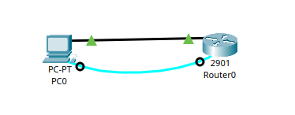

#Lab 01 - Configuração de Roteamento Básico

## Objetivos
- Configurar endereçamento IP em end systems e roteadores
- Verificar conectividade com ping

## Topologia

**Descrição**
- 1 Roteador (R1)
- 1 PC
- Rede base: 192.168.1.0/24

## Requisitos do Lab

### Cenário
Uma casa x precisa conectar seu PC em um roteador 
